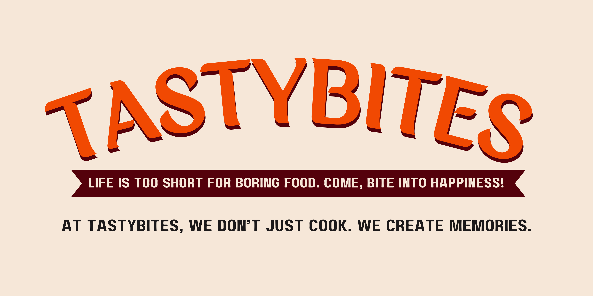

# 🍽️ TastyBites

A modern food delivery web application built with **React**, featuring authentic Hyderabadi cuisine alongside popular favorites like pizza, burgers, and more. Experience seamless online food ordering with an elegant user interface and smooth animations.

### 📸 Live Preview

> https://vision-tastybites.netlify.app/
---

## 🌟 Features

### Core Functionality

- 🍛 **Browse Menu**: Explore a diverse range of food items across multiple categories  
- 🧠 **Advanced Filtering**: Filter by category, dietary preferences, price range, and ratings  
- 🔍 **Smart Search**: Find your favorite dishes with real-time search functionality  
- 🛒 **Shopping Cart**: Add items with quantity selection and customization  
- 📱 **Responsive Design**: Optimized for desktop, tablet, and mobile  
- ✨ **Smooth Animations**: Powered by Framer Motion for better UX  

### User Experience

- 🎞️ **Hero Carousel**: Dynamic image carousel showcasing featured dishes  
- 🍽️ **Food Cards**: Detailed info with ratings, ingredients & dietary tags  
- 💾 **Cart Persistence**: Saved in `localStorage` for seamless checkout  
- 🧾 **Order Management**: Simple and smooth checkout process  
- 📞 **Contact & About**: Pages with brand and team info  

### Technical Features

- ⚛️ **React Router**: SPA navigation  
- 🌐 **Context API**: Global state management (Cart)  
- 💽 **Local Storage**: Persistent cart storage  
- 🎨 **Lucide React**: Icon library  
- 🎥 **CSS + Animations**: Smooth transitions & hover effects  

---

## 🛠️ Tech Stack

### Frontend:
- React 18  
- React Router DOM  
- Framer Motion  
- Lucide React  
- CSS3 + ES6+

### State Management:
- React Context API  
- LocalStorage

### Tooling:
- Vite   
- VS Code

---

## 🚀 Getting Started

### 📦 Prerequisites

- Node.js (v14+)
- npm or yarn

### 🔧 Installation

```bash
git clone https://github.com/yourusername/tastybites.git
cd tastybites
npm install  # or yarn install
npm run dev  # or yarn dev
```

---
## 📁 Project Structure
```
tastybites/
├── public/                 # Static assets
├── src/
│   ├── components/         # Reusable UI elements
│   │   ├── Navbar.jsx
│   │   ├── Footer.jsx
│   │   ├── HeroCarousel.jsx
│   │   ├── FoodCard.jsx
│   │   └── CartItem.jsx
│   ├── pages/
│   │   ├── HomePage.jsx
│   │   ├── MenuPage.jsx
│   │   ├── CartPage.jsx
│   │   ├── AboutPage.jsx
│   │   └── ContactPage.jsx
│   ├── contexts/
│   │   └── CartContext.jsx
│   ├── data/
│   │   └── foodData.js
│   ├── assets/             # Images
│   ├── App.jsx
│   ├── App.css
│   └── main.jsx
├── package.json
└── README.md
```

---
### 🙏 Acknowledgments
- Food inspiration from authentic Hyderabadi kitchens
- Framer Motion for animation magic
- Lucide React for beautiful icons

---
TastyBites
**Bringing authentic flavors to your doorstep, one click at a time.**
